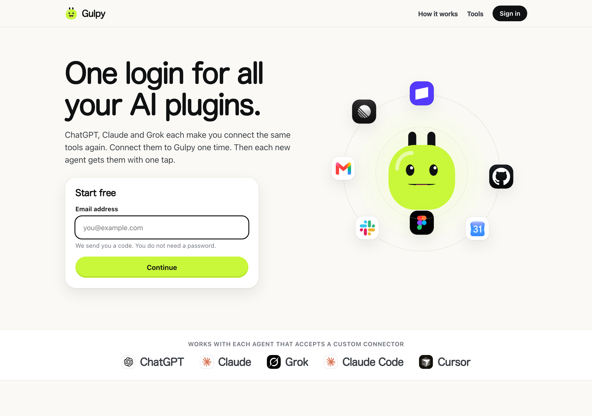
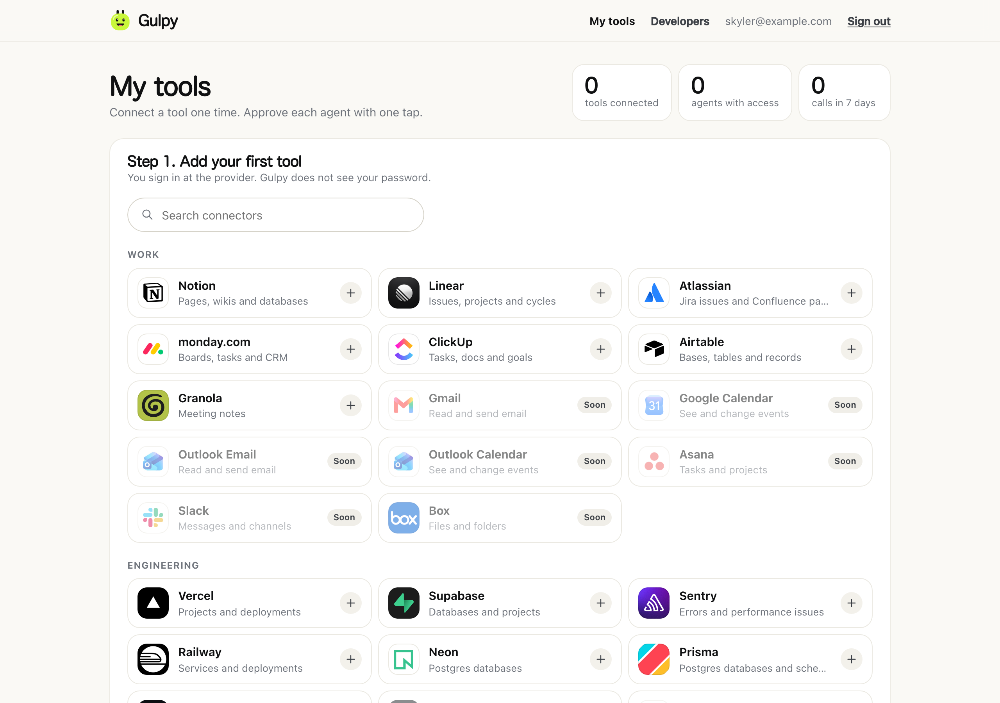
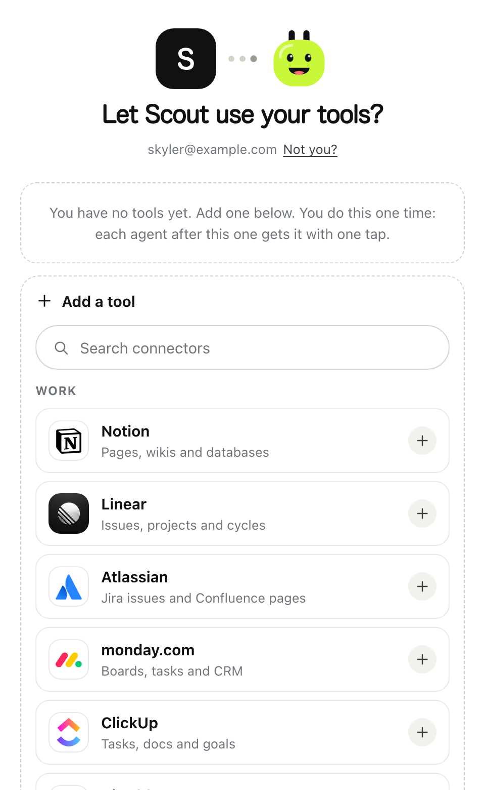

# Gulpy

One login for all your AI plugins.

ChatGPT, Claude and Grok each have a list of plugins. You connect the same tools
again in each one. Gulpy is one place for your connections. You add one address
to each agent, a window opens, you tap **Allow**, and the agent has your tools.

"Plug", read from right to left, is "gulp". The mascot is a plug that eats tools.

| The site | Your tools | A new agent asks |
|---|---|---|
|  |  |  |

The name is in one file: [src/brand.ts](src/brand.ts). The folder and the key labels keep
the first name, "connecty".

## Run it

You need [Bun](https://bun.sh) 1.3 or later.

```sh
bun install
bun run dev
```

| Address | What it is |
|---|---|
| http://localhost:4000 | **Gulpy**: the site, your tools, the approval window, the MCP server |
| http://localhost:4500 | **Orbit**, an agent to try Gulpy with. It knows the Gulpy address only. |
| http://localhost:4600 | **Scout**, a second agent |

Gulpy has no fake data. The tools are the real connectors in the list.

Do these steps:

1. Open Gulpy. Sign in with an email address. On this computer no mail goes out, so
   the page fills in the code.
2. Select **+** on a tool, for example Notion or Linear. You sign in at the provider.
3. Open Orbit. Select **Connect with Gulpy**. A window opens. Select **Allow**.
   Gulpy eats the tools and the window closes.
4. Ask Orbit a question about your tools.
5. Open Scout. Connect it. This is the one-tap flow.
6. Open Gulpy. You see the agents and each call. Remove the access of one agent.

Orbit and Scout think with the `claude` command of this computer, with your Claude
account. Each question uses a small part of your Claude plan. If the command is not
on the computer, the agents show a list of tools that you can run.

## Add Gulpy to a real agent

Add a custom connector or MCP server with this address:

```
http://localhost:4000/mcp
```

An agent on your computer, such as Claude Code, can reach `localhost`:

```sh
claude mcp add --transport http gulpy http://localhost:4000/mcp
```

ChatGPT, Claude on the web and Grok call the connector from their servers. For
them, Gulpy must have a public `https` address. Set `GULPY_BASE_URL` to it.

| Assistant | Steps |
|---|---|
| Claude | Customize, then Connectors. Select "+", then "Add custom connector". Paste the address. |
| ChatGPT | Settings, then Security and login. Turn on Developer mode. Create an app for a remote MCP server. |
| Grok | grok.com/connectors. Select New Connector, then Custom. Paste the address. |

## Real connectors

The list has 38 real connectors. On 2026-09-29 each MCP address answered with its
sign-in metadata.

| Group | Count | What you must do |
|---|---|---|
| Register automatically | 25 | Nothing. Select **+**. Notion, Linear, Atlassian, Stripe, Vercel, Supabase, Canva, Higgsfield and others. |
| Need an app that you register at the provider | 7 | GitHub, Slack, HubSpot, Asana, Box, Render, Figma. The list shows them as "Soon". |
| Use the API of the provider, with Gulpy tools (Beta) | 6 | Gmail, Google Calendar, Google Drive, Outlook Email, Outlook Calendar, OneDrive. Register one Google app and one Microsoft app (table below). |

Check the list against the real servers:

```sh
bun run scripts/check-catalog.ts              # reads public metadata only
bun run scripts/check-catalog.ts --register   # also registers Gulpy where the server permits it
```

Credentials for the connectors that need an app. Put them in the environment, or
in the macOS Keychain for development.

| Connector | Environment | Redirect address to register |
|---|---|---|
| GitHub, Slack, HubSpot, Asana, Box, Render, Figma | `CONNECTOR_<NAME>_CLIENT_ID`, `CONNECTOR_<NAME>_CLIENT_SECRET` | `<base>/oauth/callback/mcp` |
| Gmail, Google Calendar, Google Drive | `GOOGLE_CLIENT_ID`, `GOOGLE_CLIENT_SECRET` | `<base>/oauth/callback/google` |
| Outlook Email, Outlook Calendar, OneDrive | `MICROSOFT_CLIENT_ID`, `MICROSOFT_CLIENT_SECRET` | `<base>/oauth/callback/microsoft` |

```sh
security add-generic-password -a "$USER" -s gulpy-connector-github-client-id -w "<client id>" -U
security add-generic-password -a "$USER" -s gulpy-connector-github-client-secret -w "<client secret>" -U
```


## How it works

```
   Agent (Orbit, ChatGPT, Claude, Grok)            Gulpy                      Connector (Notion)
        |                                             |                               |
        |  1. POST /mcp with no token                 |                               |
        |-------------------------------------------->|                               |
        |     401, with the address of the metadata   |                               |
        |  2. reads the metadata, registers itself    |                               |
        |-------------------------------------------->|                               |
        |  3. sends the user to /oauth/authorize      |                               |
        |        the user selects connections and     |   (first time for a           |
        |        taps Allow access                    |    connector: the user        |
        |  4. code -> access token + refresh token    |    signs in at Notion)        |
        |<--------------------------------------------|------------------------------>|
        |  5. tools/list, tools/call                  |   tools/call with the token   |
        |-------------------------------------------->|   of the user                 |
        |                                             |------------------------------>|
```

Three objects carry the design:

- A **connection** is one account at one connector. It belongs to the user. It holds
  the tokens, encrypted.
- A **grant** gives one agent access to one connection, as **Read only** or
  **Read and write**. The user makes it on the approval page and can remove it.
- A **connector** is an entry in the list. It is an MCP server that the provider
  operates, or a provider API for which Gulpy supplies the tools.

The agent never gets the token of a connector. Gulpy reads the grant on each
call and then makes the call.

This follows the MCP authorization specification: OAuth 2.1 with PKCE, protected
resource metadata (RFC 9728), server metadata (RFC 8414), dynamic client
registration (RFC 7591), and client ID metadata documents. The specification
forbids a server to pass on the token of the agent. It permits a proxy that has
consent for each client. Gulpy is that proxy.

## Link: connect from your own page

An app can also open Gulpy in a window from its own page, as Plaid Link does.
Register the app at http://localhost:4000/developers.

```ts
// 1. On your server
const { link_token } = await post("/v1/link/token/create", {
  client_id, secret, capabilities: ["email.read", "calendar.read"],
});
```

```html
<!-- 2. On your page. Call Gulpy.open directly in the click handler. -->
<script src="http://localhost:4000/link.js"></script>
<script>
  button.onclick = () =>
    Gulpy.open({
      linkToken: () => fetch("/api/link-token", { method: "POST" }).then((r) => r.json()).then((d) => d.link_token),
      onSuccess: ({ publicToken }) => fetch("/api/exchange", { method: "POST", body: JSON.stringify({ publicToken }) }),
    });
</script>
```

```ts
// 3. On your server
const { access_token } = await post("/v1/link/public_token/exchange", { client_id, secret, public_token });
const mail = await fetch("http://localhost:4000/v1/email/messages?q=invoice", {
  headers: { authorization: `Bearer ${access_token}` },
});
```

### API for Link apps

All paths start with `/v1`. Errors have the shape `{ "error": { "code", "message" } }`.

| Method and path | Auth | What it does |
|---|---|---|
| `POST /link/token/create` | client ID + secret | Makes a link token. It works for 30 minutes. |
| `POST /link/public_token/exchange` | client ID + secret | Gives an access token for one user. |
| `GET /connections` | access token | Lists the accounts that the user shared. |
| `DELETE /connections/:id` | access token | The app gives up its access to one account. |
| `GET /email/messages`, `GET /email/messages/:id`, `POST /email/messages` | access token | Mail |
| `GET /calendar/events`, `POST /calendar/events` | access token | Calendar |
| `GET /files?q=`, `GET /files/:id` | access token | Files in Google Drive and OneDrive: search, and read the text. Beta. |
| `ANY /proxy/:connection_id/:service/*` | access token | A raw request to the provider API. Off by default. |

| Error code | Status | Meaning |
|---|---|---|
| `not_granted` | 403 | The user did not give this. |
| `connection_needs_reauth` | 409 | The provider cancelled the token. The user must reconnect. |
| `connection_required` | 400 | The user shared two or more accounts. Send `connection_id`. |
| `invalid_token` | 401 | The user removed the access, or the token is wrong. |

## Settings

| Variable | Default | Meaning |
|---|---|---|
| `GULPY_BASE_URL` | `http://localhost:4000` | The public address of Gulpy |
| `GULPY_MASTER_KEY` | made and kept in the Keychain (development) | 32 bytes, base64. Encrypts the tokens. Necessary in production. |
| `GULPY_DB` | `.data/gulpy.db` | The SQLite file |
| `RESEND_API_KEY`, `MAIL_FROM` | not set | Sends sign-in codes by email. Necessary in production. |
| `GULPY_RAW_PROXY` | none | Provider ids for which `/v1/proxy` is on. Keep Google and Microsoft out. |
| `STRIPE_SECRET_KEY`, `STRIPE_WEBHOOK_SECRET` | not set | Paid plans through Stripe. See [Paid plans](#paid-plans). Without them, each person is on Free. |

In development on macOS, each secret can also sit in the Keychain: `gulpy-stripe-secret-key`, `gulpy-stripe-webhook-secret`, and the same pattern for the provider credentials.

## Paid plans

Gulpy sells the plans Personal, Family and Business through Stripe. The products, the prices and the payment links live in Stripe; the `stripe` script of the marketing site makes them. Gulpy needs only the secret key and the signing secret of one webhook endpoint at `<GULPY_BASE_URL>/stripe/webhook`, with the events `checkout.session.completed`, `customer.subscription.created`, `customer.subscription.updated` and `customer.subscription.deleted`.

| Address | What it does |
|---|---|
| `GET /billing/checkout?plan=personal&interval=yearly` | Sends the signed-in person to the Stripe checkout of the plan. The link carries the user id, so the payment lands on this account. The pricing page of the site links here. |
| `POST /stripe/webhook` | Stripe reports each payment and each change of a subscription. Gulpy checks the signature and writes the plan of the person into the `subscriptions` table. |
| `GET /?checkout=<session id>` | Where Stripe sends the person after payment. Gulpy reads the session and shows the plan at once. |
| `POST /billing/portal` | Opens the Stripe customer portal: cancel, change the plan or the number of users, change the card, see invoices. |

What a plan changes: a person on Free keeps 7 days of calls in the activity list; a paid plan keeps `LEGAL.callLogDays`. The dashboard shows the plan under Your account, and the export has it. With no Stripe settings, all of this is off and Gulpy shows no plan.

## Security model

| Threat | Control |
|---|---|
| The database is stolen | Tokens and client registrations are encrypted with AES-256-GCM. Each value is bound to its row. Secrets of apps, access tokens, refresh tokens and session IDs are stored as hashes only. |
| An agent does more than the user approved | The agent never gets the token of a connector. Gulpy reads the grant on each call. Read access gives only the tools that say that they only read. |
| A false agent asks for access | The approval page shows where the agent returns the user to, and says that the agent is not verified. Gulpy redirects only to a registered address. |
| A copy of a refresh token | A refresh token works one time. A second use cancels all tokens of that sign-in. |
| A stolen authorization code | PKCE with S256 is necessary. A code works one time, for 5 minutes. |
| A client metadata address that points to the internal network | Gulpy refuses IP addresses and `localhost`. In production it also resolves the name and refuses private addresses. It follows no redirect. |
| A page on a different site submits a form | Gulpy checks `Sec-Fetch-Site`, and each form has a secret field. Cookies are `SameSite=Lax` and `HttpOnly`. |
| An attacker signs the victim in to the attacker's account | A sign-in code works only in the browser that asked for it. A provider callback works only in the session that started it. |
| A hidden frame gets a click on **Allow access** | Pages forbid frames (`frame-ancestors 'none'`). |
| Two apps compare their users | Each Link app sees a different user ID for the same person. |
| The user wants to know what happened | The dashboard shows each call. It records the tool and the result, not the content. |

Known gaps:

- **Tool descriptions come from the connector and go to the AI model.** A bad connector
  can put instructions in them. Gulpy limits the length. It does not inspect the text.
- The agents that register automatically are not verified. Gulpy has no list of
  known agents yet.
- No rate limits. One server process only: the refresh lock is in memory.

## Logos

Each connector and each agent shows the logo of its company. The images are in
`src/assets/logos/`. `manifest.json` in that folder has the source address of each one.

```sh
~/.local/py/bin/python scripts/fetch-logos.py          # gets all logos again
~/.local/py/bin/python scripts/fetch-logos.py slack    # gets one
```

An agent gives its own name, so the name is not proof. The approval window shows the
logo of Claude, ChatGPT, Grok or Cursor only if each return address of the agent is on
the site of that company.

## Project layout

```
src/
  catalog.ts        the list of connectors
  logos.ts          the logo images, and the rule for the logo of an agent
  agents.ts         Gulpy as an OAuth server for agents
  upstream/         Gulpy as a client of an upstream MCP server
  service.ts        tools, mail, calendar and proxy operations
  vault.ts          token encryption and refresh
  store.ts          all SQL (SQLite), with migrations
  link.ts           Link: tokens, account choices, approval
  oauth.ts          sign-in at a provider that has its own API
  providers/        google.ts, microsoft.ts
  routes/           pages.tsx, info.tsx (support, security, privacy, terms), oauth.ts, mcp.ts, api.ts, billing.ts (the Stripe webhook)
  billing.ts        paid plans: the Stripe checkout, the webhook events, the customer portal
  views/            the pages
examples/
  agent/            Orbit and Scout. They think with the `claude` command.
scripts/            dev.ts, check-catalog.ts, fetch-logos.py, make-social.py (the picture for link previews)
Dockerfile          Gulpy for a host
test/               end-to-end tests. They use no network.
  fixtures/         a mail provider and MCP connectors for the tests only
```

## Tests

```sh
bun test          # 122 tests
bun run typecheck
```

## Status

Verified:

- The full flow: 122 automated tests, and runs in a real browser (Chromium) with the
  pop-up window. The tests use a mail provider and connectors that exist for the tests only.
- A real AI agent: Claude answered questions with tools that came through Gulpy.
- The agent side, with the official MCP SDK as the agent: discovery, registration,
  sign-in, token refresh, tool calls.
- The registration of Gulpy at 24 real connectors. Their sign-in pages show the name "Gulpy".

- Gulpy in production mode with the real address setting (`https://gulpy.ai`).

Not verified:

- The container build from `Dockerfile`.
- **The sign-in of a user at a real connector, and a tool call with a real account.**
  This needs your accounts. Select **+** on a tool to try it.
- The Google and Microsoft adapters did not run against the real services. They show **Beta**.
- Google Drive and OneDrive give text for Google Docs, Sheets (first sheet), Slides and text files only.
  Word, Excel, PowerPoint and PDF files give a link and no text.
- ChatGPT, Claude and Grok as the agent. They need a public `https` address.
- Mail to a real person. The `ResendMailer` sent one message to the test mailbox of Resend (HTTP 200).

Not built yet:

- The Google and Microsoft apps. Without `GOOGLE_*` and `MICROSOFT_*`, their 6 tools show "Soon".
- The 7 tools that show "Soon": GitHub, Slack, HubSpot, Asana, Box, Render, Figma. Each needs an app at the provider.
- Skills and plugin packs. Gulpy has connectors only.
- Connectors that use an API key and no OAuth, for example Exa and Firecrawl.
- Passkeys for sign-in to Gulpy.
- A search across the 830 connectors of the Claude directory.

## Run your own Gulpy

Gulpy is one process with one SQLite file. You can run it on your own server and keep
all your connections there.

1. Copy `.env.example` to `.env`.
2. Set `GULPY_BASE_URL` to your public `https` address.
3. Set `GULPY_MASTER_KEY` to 32 random bytes (`openssl rand -base64 32`). Keep a copy in a
   safe place. Without it, the stored tokens cannot be read.
4. Set `RESEND_API_KEY` and `MAIL_FROM`, so that the sign-in codes go out by email.
5. Start it with `bun run start`, or build the `Dockerfile`.
6. Optional: sell plans. See [Paid plans](#paid-plans). Without it, everybody is on Free.

## Security

Report a security problem in private. Do not open a public issue. See [SECURITY.md](SECURITY.md).

## License

[GNU Affero General Public License v3.0](LICENSE). You can use, change and run Gulpy for
free. If you run a changed copy as a service for other people, you must publish your changes
under the same license.
